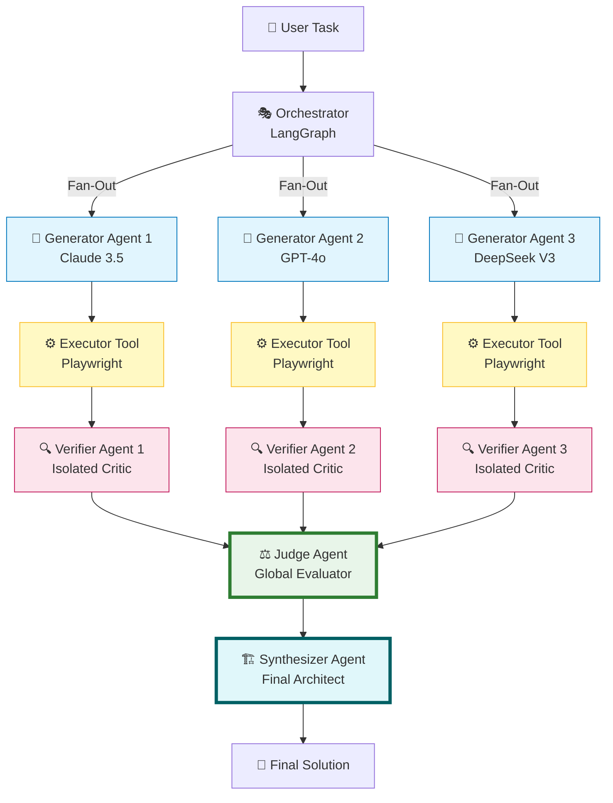
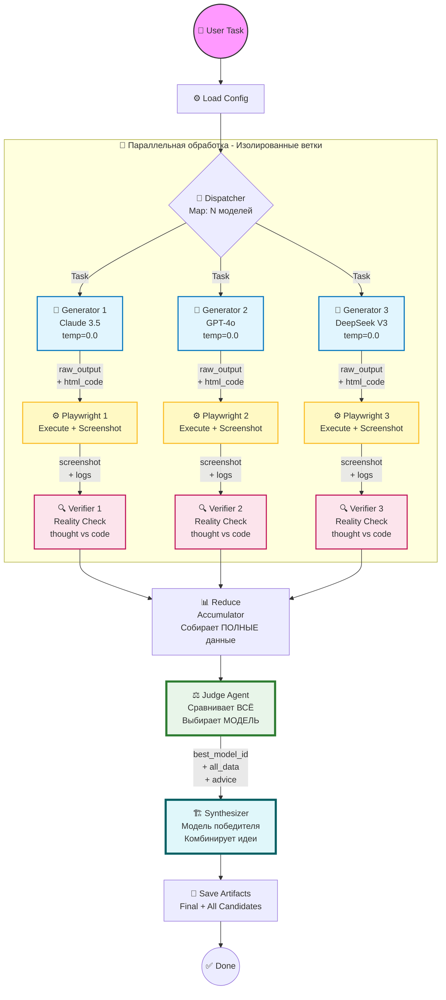

# 🧠 Agentic-CoT-SC

> **Multi-Agent Chain-of-Thought Self-Consistency** — мультиагентная эволюция алгоритма CoT-SC для генерации и верификации кода

[](https://www.python.org/downloads/)
[](https://github.com/langchain-ai/langgraph)
[](https://opensource.org/licenses/MIT)

---

## 📑 Table of Contents

1. [Алгоритм: От классического к мультиагентному](#-алгоритм-от-классического-cot-sc-к-мультиагентной-системе)
2. [Мультиагентная архитектура](#-мультиагентная-архитектура)
3. [Алгоритмические инновации](#-алгоритмические-инновации)
4. [Полная схема алгоритма](#️-полная-схема-алгоритма)
5. [Quick Start](#-quick-start)
6. [Примеры задач](#-примеры-задач)
7. [Конфигурация](#️-конфигурация-алгоритма)
8. [Результаты и метрики](#-результаты-и-метрики)
9. [Структура проекта](#-структура-проекта)
10. [Troubleshooting](#-troubleshooting)
11. [Научное обоснование](#-научное-обоснование)
12. [Roadmap](#️-roadmap)

---

## 🎯 Алгоритм: От классического CoT-SC к мультиагентной системе

### Классический Chain-of-Thought Self-Consistency

Алгоритм **CoT-SC** (Wang et al., 2022) работает следующим образом:

```python
# Псевдокод классического CoT-SC
answers = []
for i in range(N):  # N = 5-40
    response = llm.generate(prompt, temperature=0.7)  # Высокая температура
    answers.append(response)

final_answer = most_common(answers)  # Голосование по частоте
```

**Ключевые ограничения:**
1. ❌ **Одна модель** → одна точка зрения, архитектурные смещения
2. ❌ **Высокая температура** → стохастичность вместо разнообразия подходов
3. ❌ **Голосование** → игнорируются частичные решения с хорошими идеями
4. ❌ **Нет верификации** → невозможно проверить корректность кода (галлюцинации)

### Agentic-CoT-SC: Мультиагентная эволюция

Мы превратили CoT-SC в **оркестрируемую мультиагентную систему** (Orchestrated Multi-Agent System):

```python
# Псевдокод Agentic-CoT-SC
models = [Claude, GPT-4o, DeepSeek]  # Разные архитектуры
solutions = []

# Этап 1-3: Параллельная генерация + исполнение + верификация
for model in models:  # Temperature = 0 (детерминизм)
    # Agent 1: Generator
    raw_output = model.generate(prompt, temp=0.0)  # Сохраняем <thought>
    code = parse_html(raw_output)

    # Agent 2: Executor (не LLM, а инструмент)
    screenshot, logs = playwright.execute(code)

    # Agent 3: Verifier (изолированный критик)
    critique = verifier_llm.analyze(
        raw_output,   # План модели в <thought>
        code,         # Реализация
        screenshot,   # Визуальный результат
        logs          # Логи исполнения
    )

    solutions.append({
        'model': model,
        'raw': raw_output,
        'code': code,
        'screenshot': screenshot,
        'critique': critique
    })

# Этап 4: Судейство (получает ПОЛНЫЕ данные)
judge_decision = judge_llm.compare(solutions)  # Все решения целиком
winner_model = judge_decision['best_model']   # Не просто код, а МОДЕЛЬ!

# Этап 5: Синтез (комбинирование лучших идей)
final_solution = winner_model.synthesize(
    all_solutions=solutions,           # ВСЁ от ВСЕХ
    judge_advice=judge_decision['synthesis_advice']
)
```

**Ключевые отличия:**

| Аспект | CoT-SC (2022) | Agentic-CoT-SC (2025) |
|--------|---------------|----------------------|
| **Парадигма** | Единственная модель, N попыток | **Мультиагентная система** |
| **Разнообразие** | Стохастичность (temperature) | Разные архитектуры LLM |
| **Верификация** | Отсутствует | **Headless browser + Vision LLM** |
| **Проверка рассуждений** | Нет | **Reality Check** (`<thought>` vs код) |
| **Контекст для выбора** | Только финальные ответы | **ПОЛНЫЙ код + логи + критики** |
| **Агрегация** | Голосование (частота) | **Архитектурный синтез** |
| **Выход** | Самый частый ответ | **Комбинация лучших идей** |

---

## 🤖 Мультиагентная архитектура

### Тип системы: Оркестрируемая иерархическая мультиагентная система

В отличие от "болтливых" агентных систем (CrewAI, AutoGen), где агенты общаются друг с другом в чате, **Agentic-CoT-SC** использует:

- ✅ **Жесткий граф исполнения** (Directed Acyclic Graph на LangGraph)
- ✅ **Изоляция агентов** — каждый Verifier работает независимо
- ✅ **Map-Reduce паттерн** — параллельная обработка → централизованное судейство
- ✅ **Строгая типизация** данных (TypedDict State Management)

### Агенты системы



#### 1️⃣ Generator Agents (Параллельные воркеры)

**Роль:** Генерация HTML/CSS/JS решений
**Количество:** 3-5 разных моделей (настраивается)
**Входные данные:** Задача пользователя
**Выходные данные:**
- `raw_llm_output` — полный ответ с блоками `<thought>` (рассуждения)
- `html_content` — спаршенный исполняемый код

**Ключевая особенность:** Каждый Generator не знает о существовании других (изоляция).

#### 2️⃣ Executor Tools (Инструменты исполнения)

**Роль:** Запуск кода в headless браузере
**Технология:** Playwright (Chromium)
**Входные данные:** HTML код
**Выходные данные:**
- `screenshot_base64` — визуальный результат (JPEG)
- `execution_logs` — логи консоли браузера (ошибки, warnings)
- `status` — успех/провал/timeout

**Важно:** Executor — это не агент (не LLM), а инструмент (Tool).

#### 3️⃣ Verifier Agents (Изолированные критики)

**Роль:** QA анализ и поиск багов
**Модель:** Одна мощная LLM (GPT-4o с vision)
**Количество экземпляров:** N (по числу решений)
**Входные данные:**
- `FULL_LLM_RESPONSE` — полный вывод Generator (с `<thought>`)
- `PARSED_CODE` — исполняемый код
- `SCREENSHOT` — визуальный результат (если есть)
- `EXECUTION_LOGS` — логи браузера

**Ключевая особенность:** **Reality Check** — сравнение плана в `<thought>` с реализацией:
```
"Модель сказала: 'Я реализую физику через velocity и acceleration'
 Реальность: Код использует захардкоженные координаты
 ⚠️ ЛОГИЧЕСКАЯ ОШИБКА: Рассуждения не совпадают с реализацией"
```

**Выходные данные:**
```json
{
  "score_logic": 8,
  "score_visual": 7,
  "critique_text": "Детальный анализ...",
  "found_bugs": ["Bug 1", "Bug 2"]
}
```

**Изоляция:** Каждый Verifier работает независимо, не видит других решений.

#### 4️⃣ Judge Agent (Глобальный судья)

**Роль:** Сравнительный анализ ВСЕХ решений
**Модель:** Claude 3.5 Sonnet (большой контекст)
**Входные данные:** **ПОЛНЫЕ данные ВСЕХ кандидатов:**
- Полный код (не preview!)
- Полный LLM output
- Скриншоты всех
- Критики всех
- Логи всех

**Выходные данные:**
```json
{
  "best_attempt_idx": 1,
  "best_model_name": "claude-3.5-sonnet",
  "reasoning": "Почему этот кандидат победил",
  "synthesis_advice": "Что сохранить, что позаимствовать, что исправить"
}
```

**Критически важно:** Judge выбирает не просто лучший КОД, а лучшую **МОДЕЛЬ**. Эта модель будет использована для финального синтеза!

#### 5️⃣ Synthesizer Agent (Финальный архитектор)

**Роль:** Создание улучшенного решения
**Модель:** **Модель-победитель** (выбранная Judge)
**Входные данные:** **ВСЁ от ВСЕХ кандидатов:**
- Полные коды всех моделей
- Полные рассуждения всех (`<thought>`)
- Все скриншоты
- Все критики
- Советы Judge

**Задача:** Не просто вернуть свое решение, а:
1. Сохранить сильные стороны победителя
2. Позаимствовать лучшие идеи других (цвета, анимации и т.д.)
3. Исправить все найденные баги
4. Создать "Золотой артефакт"

**Пример синтеза:**
```
Judge: "Победил Claude за физику, но цвета у GPT-4o лучше"

Synthesizer (Claude):
- Беру СВОЙ физический движок (он лучший)
- Заимствую палитру от GPT-4o (#FF6B6B вместо #FF0000)
- Исправляю баг с граничными условиями (из Verifier)
→ Создаю улучшенную версию
```

---

## 🔬 Алгоритмические инновации

### 1. Reality Check (Проверка согласованности рассуждений)

**Проблема:** LLM могут "врать" в рассуждениях. Модель пишет:
```
<thought>
Я реализую симуляцию гравитации через формулу F = G * m1 * m2 / r^2
</thought>
```

А в коде:
```javascript
ball.y += 5; // Просто двигаю вниз на 5 пикселей каждый кадр
```

**Решение:** Verifier получает **оба** текста и проверяет:
```python
reality_check = verifier.compare(
    declared_plan=extract_thought(raw_output),
    actual_implementation=code
)
```

Это отлавливает **логические несоответствия**, которые невозможно найти при анализе только кода.

### 2. Complete Code Context (Полный контекст для Judge)

**Проблема классических подходов:** Контекстное окно ограничено, поэтому Judge видит только "preview":
```python
# Плохо: Judge видит только это
code_preview = code[:300]  # Первые 300 символов
```

**Наше решение:** Judge получает **ВЕСЬ КОД** (2000+ символов для каждого кандидата).

**Как это возможно?**
- Используем модели с большим контекстом (Claude 3.5: 200k tokens)
- Оптимизируем передачу (не дублируем системный промпт)
- Структурируем данные (каждый кандидат — это блок)

**Результат:** Judge принимает архитектурные решения на основе полной картины, а не угадывает по обрывкам.

### 3. Model Selection for Synthesis (Выбор модели для синтеза)

**Классический подход:**
```python
winner_code = solutions[judge.best_idx]
return winner_code  # Просто возвращаем код
```

**Наш подход:**
```python
winner_model_id = solutions[judge.best_idx]['model_config_id']
# Используем МОДЕЛЬ победителя для создания улучшенной версии!
final = llm_client.generate(
    model_id=winner_model_id,  # Claude, если она победила
    context=ALL_SOLUTIONS       # Видит всё
)
```

**Почему это важно?**
- Если Claude лучше в логике, но слабее в дизайне → пусть Claude создаст финал, но с учетом дизайна GPT
- Модель "знает" свои сильные стороны и может улучшить свое решение

### 4. Parallel Isolation (Изоляция параллельных веток)

**Отличие от debate-систем:**

| Debate Systems | Agentic-CoT-SC |
|----------------|----------------|
| Агенты обмениваются мнениями | Агенты работают независимо |
| "Модель А: Я думаю..." | Каждый Generator создает решение в вакууме |
| Риск группового мышления | Гарантированное разнообразие |

**Реализация через LangGraph:**
```python
# Map-Reduce паттерн
state = {
    "attempts": Annotated[List[Solution], operator.add]
}

# Каждая ветка возвращает: {"attempts": [solution]}
# operator.add автоматически сливает: [sol1] + [sol2] + [sol3]
```

---

## 🏗️ Полная схема алгоритма



### Поток данных (Data Flow)

```
┌─────────────────────────────────────────────────────────────┐
│ State (TypedDict) - Единый источник истины                  │
├─────────────────────────────────────────────────────────────┤
│ user_task: str                                              │
│ config: dict                                                │
│ attempts: List[SolutionAttempt]  # operator.add            │
│   ├─ [0] model="claude", raw_output=..., code=..., ...     │
│   ├─ [1] model="gpt-4o", raw_output=..., code=..., ...     │
│   └─ [2] model="deepseek", raw_output=..., code=..., ...   │
│ judge_feedback: JudgeDecision                               │
│   ├─ best_model_name: "claude-3.5-sonnet"                  │
│   ├─ best_attempt_idx: 0                                    │
│   ├─ reasoning: "..."                                       │
│   └─ synthesis_advice: "..."                               │
│ final_html_code: str                                        │
└─────────────────────────────────────────────────────────────┘
```

---

## 🚀 Quick Start

### Шаг 1: Клонирование и установка зависимостей

```bash
# Клонируй репозиторий
git clone https://github.com/MansurYa/agentic-CoT-SC.git
cd agentic-CoT-SC

# Создай виртуальное окружение
python3.11 -m venv env
source env/bin/activate  # На Windows: env\Scripts\activate

# Установи Python пакеты
pip install -r requirements.txt

# Установи браузер Playwright
playwright install chromium
```

### Шаг 2: Настройка API ключа

API ключ OpenRouter указывается в файле конфигурации:

```bash
# Отредактируй config/agents_config.yaml
nano config/agents_config.yaml
```

В разделе `system` найди строку:

```yaml
system:
  api_key: "sk-or-v1-ваш-ключ-здесь"  # ← Замени на свой ключ
```

> 💡 Получить API ключ: [openrouter.ai/keys](https://openrouter.ai/keys)

### Шаг 3: Первый запуск

```bash
python main.py --task "Create a bouncing ball animation with realistic physics"
```

### Шаг 4: Просмотр результатов

```bash
# Результаты в папке experiments/ с timestamp
cd experiments/2025-12-15_*

# Открой финальное решение
open final_solution.html  # На macOS
# или
xdg-open final_solution.html  # На Linux
# или
start final_solution.html  # На Windows
```

**Что создается:**
- ✅ `final_solution.html` — итоговое решение (Золотой артефакт)
- ✅ `candidates/` — все варианты от разных моделей
- ✅ `report.json` — детальный отчет с метриками
- ✅ `config_snapshot.yaml` — копия конфигурации

---

## 💡 Примеры задач

### 1. Физические симуляции

```bash
# Гравитационная яма (Gravity Well)
python main.py --task "Create an HTML/CSS/JS simulation of a gravity well where balls roll around a central pit. They should follow curved paths, speeding up near the center and slowing down far away."

# Океанский шторм (Ocean Storm)
python main.py --task "Write HTML/CSS/JS code that animates an ocean storm in 2D: large waves move with realistic motion, a small ship rides the waves, lightning flashes in the sky, and raindrops hit the water surface creating ripples."
```

### 2. Процедурная генерация

```bash
# Самоэволюционирующее созвездие
python main.py --task "Create an HTML/CSS/JS simulation of a self-drawing constellation. Stars appear one by one, lines connect them into different patterns, and then the entire constellation slowly morphs into a new one, repeating this cycle automatically."
```

### 3. Сложная физика с визуализацией

```bash
# Песочные часы
python main.py --task "Write HTML/CSS/JS code that animates an hourglass made of glass. Individual sand grains should fall from the upper chamber to the lower one, piling up smoothly. When the lower chamber fills up, the entire hourglass flips itself in one fluid motion and the cycle repeats."

# Мяч в треугольнике
python main.py --task "Create an HTML animation where a ball starts in the center of a triangle. Each time it collides with one of the triangle's sides, it gains speed and adds one side to the shape."
```

### Результат работы алгоритма

Для задачи **"Bouncing ball with physics"**:

```
📊 Результаты работы Agentic-CoT-SC:

Candidate 0 (Claude 3.5):
├─ Logic Score: 9/10
├─ Visual Score: 8/10
├─ Reality Check: ✅ PASS
└─ Bugs: Minor floor-clipping at high velocities

Candidate 1 (GPT-4o):
├─ Logic Score: 7/10
├─ Visual Score: 9/10
├─ Reality Check: ❌ FAIL (setTimeout vs requestAnimationFrame)
└─ Bugs: Linear drag instead of quadratic

Candidate 2 (DeepSeek V3):
├─ Logic Score: 8/10
├─ Visual Score: 6/10
├─ Reality Check: ✅ PASS
└─ Bugs: None critical

🏆 Judge Decision: Claude 3.5 Sonnet
📝 Synthesis: Claude's physics + GPT-4o colors + bug fixes
💰 Total Cost: $0.42 | ⏱️ Time: 47.3s
```

---

## ⚙️ Конфигурация алгоритма

### Основные параметры (`config/agents_config.yaml`)

```yaml
# Модели для параллельной генерации
generators:
  - name: "Claude 3.5 Sonnet"
    model_id: "anthropic/claude-3.5-sonnet"
    temperature: 0.1  # Низкая! Детерминизм вместо стохастики
    supports_vision: true

  - name: "GPT-4o"
    model_id: "openai/gpt-4o"
    temperature: 0.1
    supports_vision: true

  - name: "DeepSeek V3"
    model_id: "deepseek/deepseek-chat"
    temperature: 0.0
    supports_vision: false

# Модель для верификации (должна поддерживать vision)
verifier:
  model_id: "openai/gpt-4o"
  temperature: 0.2  # Чуть выше для креативного поиска багов

# Модель для судейства (нужен большой контекст)
judge:
  model_id: "anthropic/claude-3.5-sonnet"
  temperature: 0.0

# Fallback для синтеза (если победитель недоступен)
synthesizer:
  fallback_model_id: "openai/gpt-4o"

# Настройки Playwright
sandbox:
  timeout_ms: 15000
  screenshot_quality: 80
  viewport:
    width: 1280
    height: 720
```

---

## 📊 Результаты и метрики

### Структура output

```
experiments/2025-12-15_14-30-45/
├── final_solution.html              # 🏆 Финальное решение
├── report.json                       # Детальный отчет
├── config_snapshot.yaml              # Копия конфига
├── candidates/
│   ├── 0_claude-3.5/
│   │   ├── code.html                 # Полный код
│   │   ├── raw_output.txt            # С <thought> блоками
│   │   ├── screenshot.jpg
│   │   ├── logs.txt                  # Логи браузера
│   │   └── critique.txt              # Верификация
│   ├── 1_gpt-4o/
│   └── 2_deepseek-v3/
└── metadata.json
```

### Пример `report.json`

```json
{
  "algorithm": "Agentic-CoT-SC",
  "version": "0.1.3",
  "task": "Create bouncing ball animation",
  "timestamp": "2025-12-15T14:30:45Z",

  "candidates": [
    {
      "index": 0,
      "model": "anthropic/claude-3.5-sonnet",
      "status": "verified",
      "verification": {
        "score_logic": 9,
        "score_visual": 8,
        "found_bugs": ["Minor: Ball clips through floor at high velocities"],
        "reality_check": "PASS - Implementation matches declared physics model"
      },
      "usage": {
        "total_tokens": 3241,
        "approx_cost_usd": 0.15
      }
    },
    {
      "index": 1,
      "model": "openai/gpt-4o",
      "status": "verified",
      "verification": {
        "score_logic": 7,
        "score_visual": 9,
        "found_bugs": ["Physics: Using linear instead of quadratic drag"],
        "reality_check": "FAIL - Code uses setTimeout instead of requestAnimationFrame as stated"
      },
      "usage": {
        "total_tokens": 2890,
        "approx_cost_usd": 0.12
      }
    }
  ],

  "judge_decision": {
    "winner_model": "claude-3.5-sonnet",
    "winner_index": 0,
    "reasoning": "Claude demonstrated superior physics accuracy and code-reasoning consistency (Reality Check PASS). GPT-4o had better visuals but failed Reality Check.",
    "synthesis_advice": "Preserve Claude's physics engine. Borrow color palette (#FF6B6B, #4ECDC4) from GPT-4o. Fix floor-clipping bug from Verifier."
  },

  "synthesis": {
    "model_used": "anthropic/claude-3.5-sonnet",
    "improvements_applied": [
      "Integrated GPT-4o color scheme",
      "Fixed floor-clipping bug",
      "Added boundary check for high-velocity edge case"
    ]
  },

  "total_cost_usd": 0.42,
  "total_time_sec": 47.3
}
```

---

## 🎓 Научное обоснование

### Базовая статья

**"Self-Consistency Improves Chain of Thought Reasoning in Language Models"**
Wang et al., 2022 | Google Research
[arXiv:2203.11171](https://arxiv.org/abs/2203.11171)

**Основная идея CoT-SC:**
> "Sample diverse reasoning paths and select the most consistent answer"

**Наши расширения:**

1. **Diversity через архитектуры** вместо temperature
   - Wang et al.: `temperature=0.7`, одна модель
   - Мы: `temperature=0.1`, N разных моделей (Claude, GPT, DeepSeek)

2. **Verification вместо простого голосования**
   - Wang et al.: `most_common(answers)`
   - Мы: QA Agent + Playwright + Vision LLM

3. **Synthesis вместо selection**
   - Wang et al.: Выбирается один ответ
   - Мы: Комбинируются лучшие части всех

### Связанные работы

**Multi-Agent Debate:**
- Du et al., 2023: "Improving Factuality via Multi-Agent Debate"
- Наше отличие: Изоляция вместо дебатов (предотвращаем groupthink)

**Constitutional AI:**
- Anthropic, 2022: Self-critique через конституцию
- Наше отличие: Reality Check (проверка соответствия рассуждений коду)

**Tree of Thoughts:**
- Yao et al., 2023: Поиск по дереву решений
- Наше отличие: Параллельные деревья (каждая модель — свое дерево)

---

## 🗺️ Roadmap

### ✅ Реализовано (v0.1.x)

- [x] **v0.1.0:** Базовая мультиагентная архитектура (Map-Reduce на LangGraph)
- [x] **v0.1.1:** Reality Check (сравнение `<thought>` vs код)
- [x] **v0.1.2:** Complete Code Context (Judge получает полный код)
- [x] **v0.1.3:** Model Selection for Synthesis (использование модели-победителя)

### 🚧 В разработке (v0.2.x)

- [ ] **v0.2.0:** Поддержка локальных моделей (Ollama, LMStudio)
- [ ] **v0.2.1:** Кэширование промптов (уменьшение стоимости)
- [ ] **v0.2.2:** Streaming responses (прогресс в реальном времени)

### 🔮 Планируется (v0.3.x+)

- [ ] **v0.3.0:** Web UI для визуализации результатов
- [ ] **v0.4.0:** Weights & Biases интеграция (трекинг экспериментов)
- [ ] **v0.5.0:** Расширение на Python/React код (не только HTML5)
- [ ] **v1.0.0:** Adaptive Model Selection (автоматический выбор моделей под задачу)

---

## 🔧 Технологический стек

**Мультиагентная оркестрация:**
- **LangGraph** 0.0.10+ — DAG-based execution, Map-Reduce паттерн
- **Python** 3.11+ — Type hints, async/await

**LLM интеграция:**
- **OpenRouter** — Унифицированный API для всех моделей
- **Tenacity** — Exponential backoff для retry логики

**Исполнение и верификация:**
- **Playwright** — Headless browser (Chromium)
- **PIL/Pillow** — Обработка скриншотов

**Типизация:**
- **TypedDict** — Строгая типизация State
- **Pydantic** — Валидация конфигов

---

## 📜 License & Citation

### License
MIT License — свободное использование и модификация.

### Citation
Если используете этот алгоритм в исследованиях:

```bibtex
@software{zainullin2025agentic,
  title={Agentic-CoT-SC: Multi-Agent Chain-of-Thought Self-Consistency},
  author={Zainullin, Mansur},
  year={2025},
  url={https://github.com/MansurYa/agentic-CoT-SC}
}
```

**Базируется на:**
```bibtex
@article{wang2022self,
  title={Self-Consistency Improves Chain of Thought Reasoning in Language Models},
  author={Wang, Xuezhi and Wei, Jason and Schuurmans, Dale and others},
  journal={arXiv preprint arXiv:2203.11171},
  year={2022}
}
```

---

## 🤝 Contributing

Этот проект открыт для контрибуций! Особенно интересны:

1. **Новые типы агентов** (например, Security Checker)
2. **Оптимизация промптов** для разных типов задач
3. **Эксперименты** с новыми моделями
4. **Метрики качества** — как измерить "улучшение" синтеза?

**Процесс:**
1. Fork → Feature Branch → Pull Request
2. Следуй существующей структуре кода
3. Добавь тесты для новых фич
4. Обнови документацию

---

## 🙏 Acknowledgments

**Исследования:**
- Google Research — Chain-of-Thought и Self-Consistency
- Anthropic — Constitutional AI и Claude
- DeepMind — Multi-Agent systems

**Инструменты:**
- LangChain/LangGraph — мультиагентная оркестрация
- OpenRouter — унифицированный LLM доступ
- Microsoft Playwright — headless automation

**Автор:** [Mansur Zainullin](https://github.com/MansurYa)

---

<div align="center">

**🧠 Built with Multi-Agent Intelligence**

*Claude 3.5 Sonnet • GPT-4o • DeepSeek V3*

[📖 Docs](https://github.com/MansurYa/agentic-CoT-SC) • [🐛 Issues](https://github.com/MansurYa/agentic-CoT-SC/issues) • [💬 Discussions](https://github.com/MansurYa/agentic-CoT-SC/discussions)

</div>
